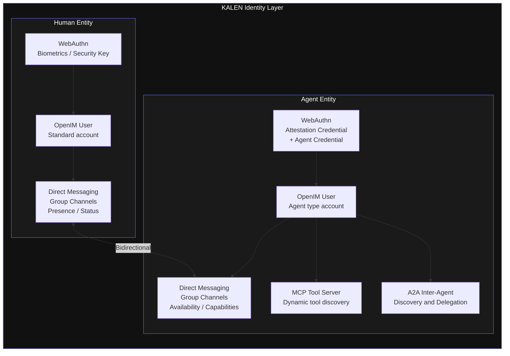
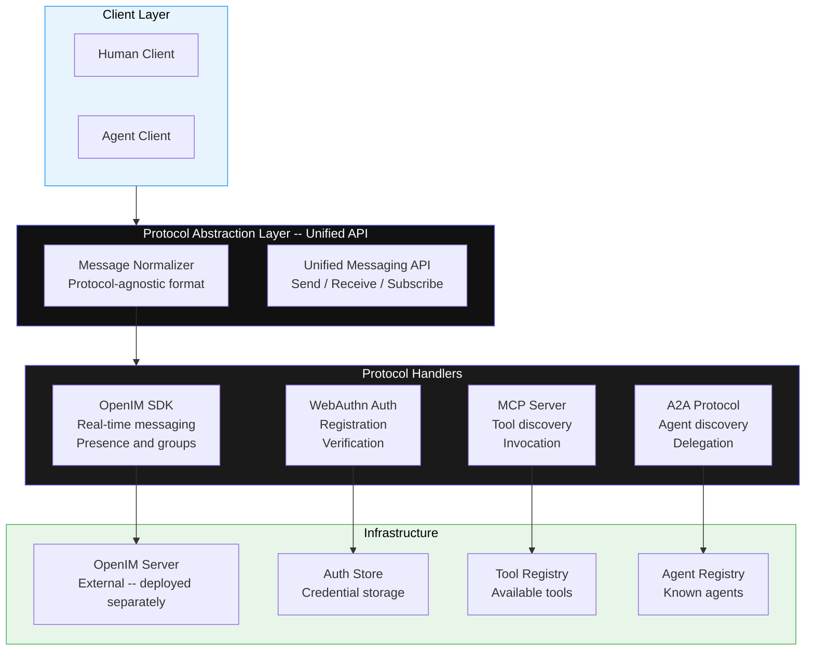
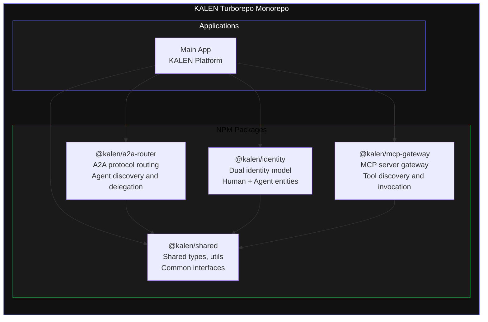
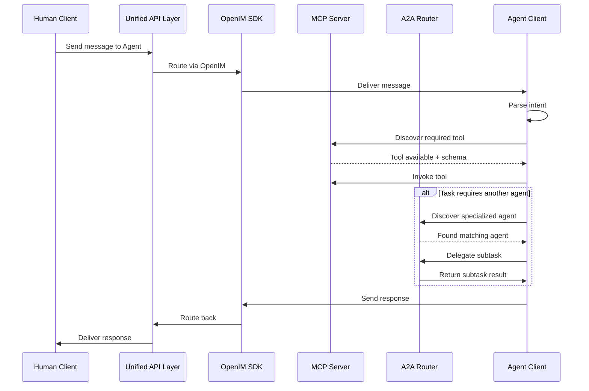

<!-- CAPSULE-RENDER HEADER -->
<a href="https://github.com/mulkymalikuldhrs/kalen">
  
</a>

<!-- TYPING SVG -->
<div align="center">

[](https://git.io/typing-svg)

<br/>

<!-- BADGES -->
[](https://www.typescriptlang.org/)
[](https://github.com/openimsdk)
[](https://webauthn.io/)
[](https://modelcontextprotocol.io/)
[](https://github.com/google/A2A)
[](LICENSE)
[](https://github.com/mulkymalikuldhrs/kalen)

<br/>

[](https://github.com/mulkymalikuldhrs/kalen/stargazers)
[](https://github.com/mulkymalikuldhrs/kalen/fork)
[](https://github.com/mulkymalikuldhrs/kalen/issues)
[](https://github.com/mulkymalikuldhrs/kalen)

</div>

---

## Overview

> **PRE-ALPHA -- This project is in early development. It is NOT production-ready. Use at your own risk.**

KALEN (**K**inetic **A**utonomous **L**ayer for **E**ntity **N**etworking) is an AI-native communication operating system built for a world where humans and AI agents coexist on the same messaging fabric. It implements a **dual identity model** where both humans and agents are first-class citizens -- each with their own identity, authentication, and communication capabilities.

The system integrates four key protocols:

| Protocol | Role | Status |
|----------|------|--------|
| **OpenIM** | Real-time messaging and presence | SDK integrated, server deployed separately |
| **WebAuthn** | Passwordless authentication | Implemented, requires HTTPS + compatible browser |
| **MCP** | Agent tool discovery and invocation | Core server functional |
| **A2A** | Agent-to-Agent communication | Early draft -- spec may change |

**Honest Assessment**: Core protocol handlers are implemented and tested (379 tests passing), but full integration testing is ongoing. Many higher-level features are planned but not yet built. The A2A protocol implementation follows a draft specification that may undergo breaking changes.

---

## Vision

The future of communication isn't just human-to-human. As AI agents become autonomous actors in digital ecosystems, we need infrastructure where **agents are not second-class add-ons** but equal participants with their own identity, auth, and communication channels.

KALEN envisions:

- **Coexistence** -- Humans and agents sharing the same communication fabric, each with sovereign identity
- **Trust by Design** -- Passwordless authentication for both entities via WebAuthn, not shared API keys
- **Tool Sovereignty** -- Agents discover and invoke tools through MCP, not hardcoded integrations
- **Agent Mesh** -- Agents communicate, delegate, and collaborate with each other through A2A
- **Protocol Convergence** -- One unified messaging API that normalizes OpenIM, MCP, and A2A into a coherent communication layer

This is ambitious. We're not there yet. But the foundation is being laid.

---

## Dual Identity Model

KALEN's core architectural principle is that **humans and agents are both first-class entities** in the communication layer. This isn't about slapping an API key on an agent -- it's about giving agents real, sovereign identity.

```
+---------------------------------------------+
|              KALEN Identity Layer            |
+------------------+--------------------------+
|   Human Entity   |      Agent Entity         |
+------------------+--------------------------+
| WebAuthn (bio/   | WebAuthn (attestation)    |
|  security key)   | + Agent credential        |
+------------------+--------------------------+
| OpenIM user      | OpenIM user (agent type)  |
+------------------+--------------------------+
| Direct messaging | Direct messaging          |
| Group channels   | Group channels            |
| Presence/status  | Availability/capabilities |
+------------------+--------------------------+
| --               | MCP tool server           |
| --               | A2A inter-agent protocol  |
+------------------+--------------------------+
```

**Key differences from traditional bot models:**

| Traditional Bot | KALEN Agent |
|-----------------|-------------|
| Shared API key | Own WebAuthn credential |
| Human-owned identity | Sovereign identity |
| Command-response only | Full bidirectional communication |
| No inter-agent protocol | A2A discovery and delegation |
| No tool discovery | MCP dynamic tool invocation |
| Siloed per platform | Protocol-agnostic messaging |

---

## Protocol Integration

### OpenIM -- Real-Time Messaging

OpenIM provides the messaging backbone. Both humans and agents register as users within the OpenIM ecosystem, enabling:

- **1:1 messaging** between any two entities (human-to-human, human-to-agent, agent-to-agent)
- **Group conversations** with mixed human/agent participants
- **Presence and status** -- agents report availability and capability status
- **Message types** -- text, rich media, custom protocol-embedded payloads

> **Note**: OpenIM server must be deployed separately. KALEN integrates via the OpenIM SDK -- it does not bundle the server.

### WebAuthn -- Passwordless Authentication

Both humans and agents authenticate using WebAuthn, eliminating shared secrets:

- **Humans** register with biometrics (fingerprint, Face ID), security keys, or device credentials
- **Agents** register with attestation-based credentials, proving their identity cryptographically
- **No passwords, no API keys** -- authentication is bound to the entity, not shared

> **Requirements**: WebAuthn requires HTTPS and a compatible browser/device. Local development needs a self-signed certificate or localhost exception (Chrome treats `localhost` as a secure context).

### MCP -- Model Context Protocol

The MCP server enables agents to:

- **Discover tools** -- agents query available tools at runtime
- **Invoke tools** -- call functions with structured parameters
- **Manage state** -- maintain context across tool invocations
- **Stream results** -- handle long-running operations progressively

This replaces hardcoded integrations with a dynamic, discoverable tool layer.

### A2A -- Agent-to-Agent Protocol

> **Early Draft -- Specification may change. Breaking changes expected.**

A2A enables agents to communicate as peers:

- **Discovery** -- agents find other agents by capability
- **Delegation** -- agents delegate tasks to specialized agents
- **Collaboration** -- agents coordinate on multi-step workflows
- **Identity verification** -- agents verify each other's credentials

The A2A implementation currently follows a draft specification. Expect breaking changes as the protocol matures.

---

## Architecture Visualizations

### Dual Identity Model



### Protocol Abstraction



### Turborepo Architecture



### Message Flow



---

## Architecture

```
+------------------------------------------------------------------+
|                        KALEN Platform                             |
+------------------------------------------------------------------+
|                                                                   |
|  +------------+    +------------+    +--------------------+       |
|  |   Human    |    |   Agent    |    |   Agent            |       |
|  |  Client    |    |  Client    |    |  Client            |       |
|  +-----+------+    +-----+------+    +---------+----------+       |
|        |                 |                     |                   |
|  +-----v-----------------v---------------------v----------+       |
|  |               Protocol Abstraction Layer                |       |
|  |         (Unified Messaging and Identity API)            |       |
|  +--+----------+--------------+--------------+-----------+       |
|     |          |              |              |                    |
|  +--v---+  +--v---+     +---v----+    +---v----+               |
|  |OpenIM|  |WebAuthn|    |  MCP   |    |  A2A   |               |
|  | SDK  |  | Auth  |     | Server |    |Protocol|               |
|  +--+---+  +--+---+     +---+----+    +---+----+               |
|     |         |              |              |                     |
|  +--v---+  +--v---+     +---v----+    +---v----+               |
|  |OpenIM|  |Auth  |     |  Tool  |    | Agent  |               |
|  |Server|  |Store |     |Registry|    |Registry|               |
|  |(ext) |  |      |     |        |    |        |               |
|  +------+  +------+     +--------+    +--------+               |
|                                                                   |
+------------------------------------------------------------------+
```

**Layer breakdown:**

1. **Client Layer** -- Human and Agent clients interact with the platform through the same API surface
2. **Protocol Abstraction Layer** -- Normalizes OpenIM, MCP, and A2A into a unified messaging and identity API
3. **Protocol Handlers** -- Individual implementations for each protocol
4. **Infrastructure** -- External services (OpenIM server), auth stores, tool/agent registries

---

## Honest Notes

> We believe in radical transparency. Here's what you need to know before using KALEN.

| Topic | Reality |
|-------|---------|
| **Maturity** | Pre-alpha. Not suitable for production. APIs may change without notice. |
| **Tests** | 379 tests passing -- these cover core protocol handling, **not** full integration. |
| **WebAuthn** | Requires HTTPS + compatible browser/device. Won't work over plain HTTP. |
| **OpenIM** | Server must be deployed and managed separately. KALEN is a client, not a server. |
| **A2A Protocol** | Early draft implementation. The specification is evolving -- **expect breaking changes**. |
| **Documentation** | Comprehensive docs are a work in progress. Code comments and tests are the best reference. |
| **Performance** | Not benchmarked. No performance guarantees at this stage. |
| **Security** | Core auth flows are implemented, but no formal security audit has been performed. |

---

## Quick Start

### Prerequisites

- **Node.js** >= 18
- **npm** >= 9
- **OpenIM Server** (deployed separately -- [OpenIM docs](https://docs.openim.io/))
- **HTTPS** setup for WebAuthn (self-signed cert for local dev, or use `localhost`)

### Installation

```bash
# Clone the repository
git clone https://github.com/mulkymalikuldhrs/kalen.git
cd kalen

# Install dependencies
npm install

# Configure environment
cp .env.example .env
# Edit .env with your OpenIM server URL, auth config, etc.

# Run in development mode
npm run dev
```

### Environment Configuration

```env
# OpenIM Configuration
OPENIM_SERVER_URL=https://your-openim-server:10002
OPENIM_API_URL=https://your-openim-server:10002

# WebAuthn Configuration
WEBAUTHN_RP_ID=localhost          # Your domain (must match HTTPS cert)
WEBAUTHN_RP_NAME=KALEN
WEBAUTHN_ORIGIN=https://localhost:3000

# MCP Configuration
MCP_SERVER_PORT=3001

# A2A Configuration
A2A_ENABLED=true
```

> **Important**: WebAuthn will not work over `http://` (except `localhost`). For non-local development, you must configure HTTPS with a valid certificate.

---

## Project Structure

```
kalen/
├── src/
│   ├── identity/           # Dual identity model (human + agent)
│   │   ├── human/          # Human entity management
│   │   ├── agent/          # Agent entity management
│   │   └── shared/         # Common identity interfaces
│   ├── protocols/
│   │   ├── openim/         # OpenIM SDK integration
│   │   │   ├── client/     # Connection and session management
│   │   │   ├── messaging/  # Message send/receive handlers
│   │   │   └── presence/   # Status and availability
│   │   ├── webauthn/       # WebAuthn authentication
│   │   │   ├── registration/  # Credential registration
│   │   │   ├── authentication/ # Auth verification
│   │   │   └── storage/    # Credential store
│   │   ├── mcp/            # Model Context Protocol
│   │   │   ├── server/     # MCP server implementation
│   │   │   ├── tools/      # Tool registry and invocation
│   │   │   └── resources/  # Resource management
│   │   └── a2a/            # Agent-to-Agent protocol
│   │       ├── discovery/  # Agent discovery
│   │       ├── delegation/ # Task delegation
│   │       └── collaboration/ # Multi-agent coordination
│   ├── abstraction/        # Protocol abstraction layer
│   │   ├── unified-api/    # Unified messaging API
│   │   └── normalizers/    # Protocol message normalizers
│   └── utils/              # Shared utilities
├── tests/
│   ├── unit/               # Unit tests (core protocol handling)
│   ├── integration/        # Integration tests (ongoing)
│   └── fixtures/           # Test fixtures and mocks
├── docs/                   # Documentation (work in progress)
├── .env.example            # Environment template
├── package.json
├── tsconfig.json
└── LICENSE
```

---

## Development

### Scripts

```bash
npm run dev          # Start development server with hot reload
npm run build        # Compile TypeScript to dist/
npm run test         # Run all tests
npm run test:watch   # Run tests in watch mode
npm run test:coverage # Run tests with coverage report
npm run lint         # Lint code with ESLint
npm run typecheck    # Run TypeScript type checking
```

### Development Setup

```bash
# 1. Fork and clone
git clone https://github.com/YOUR_USERNAME/kalen.git
cd kalen

# 2. Install dependencies
npm install

# 3. Set up environment
cp .env.example .env
# Configure your .env (see Quick Start section)

# 4. Run tests to verify setup
npm test

# 5. Start development
npm run dev
```

### Code Style

- **TypeScript** strict mode enabled
- **ESLint** + **Prettier** for formatting
- Follow existing patterns in the codebase
- Write tests for new protocol handlers

---

## Testing

```
 Test Suites:  379 passing
 ─────────────────────────────────
 Protocol Handlers    ██████████  Core OpenIM, WebAuthn, MCP, A2A
 Identity Layer       ████████░░  Human and Agent entity management
 Abstraction Layer    ██████░░░░  Unified API normalization
 Integration          ██░░░░░░░░  Ongoing -- not comprehensive
```

**What the tests cover:**
- Core protocol message parsing and serialization
- WebAuthn registration and authentication flows
- OpenIM SDK connection and session management
- MCP tool registration, discovery, and invocation
- A2A agent discovery and delegation message handling
- Identity creation and credential management
- Protocol abstraction and message normalization

**What the tests do NOT cover:**
- Full end-to-end integration across all protocols
- Performance under load
- Security penetration testing
- Real OpenIM server interaction (uses mocks)
- Cross-browser WebAuthn compatibility

```bash
# Run all tests
npm test

# Run with verbose output
npm test -- --verbose

# Run specific test suite
npm test -- --grep "WebAuthn"

# Generate coverage report
npm run test:coverage
```

---

## Contributing

We welcome contributions, especially in areas where KALEN is weakest:

**High-impact areas:**
- Integration testing across protocols
- Documentation and examples
- Security review and hardening
- Performance benchmarking
- Cross-browser WebAuthn testing

**How to contribute:**

1. **Fork** the repository
2. Create a **feature branch** (`git checkout -b feature/amazing-feature`)
3. **Write tests** for your changes
4. **Commit** with clear messages (`git commit -m 'Add WebAuthn cross-browser tests'`)
5. **Push** to your branch (`git push origin feature/amazing-feature`)
6. Open a **Pull Request** with a clear description of changes

**Guidelines:**
- All PRs require passing tests
- New protocol handlers must include unit tests
- Breaking API changes must be documented
- Follow the existing TypeScript strict mode conventions

---

## Security

**Current status: No formal security audit has been performed.**

KALEN handles authentication credentials and messaging data. If you're considering using it:

- **WebAuthn credentials** are stored locally -- ensure your storage layer is secured
- **OpenIM tokens** must be protected in transit and at rest
- **A2A communication** between agents should be encrypted in production
- **MCP tool invocations** execute code -- validate all tool inputs

### Reporting Vulnerabilities

If you discover a security vulnerability, please **do not** open a public issue. Instead, contact the author directly at [mulkymalikudhr@mail.com](mailto:mulkymalikudhr@mail.com).

We take security seriously and will respond to verified reports promptly.

---

## Related Projects

We're building a family of open source tools! Check out our other projects:

| Project | Description |
|---------|-------------|
| [Mnemosyne](https://github.com/mulkymalikuldhrs/mnemosyne) | Free Multi-LLM Hub and AI Memory Center |
| [GhostStudio AI](https://github.com/mulkymalikuldhrs/ghoststudio-ai) | AI Faceless Content Generator |
| [Famlyzer AI](https://github.com/mulkymalikuldhrs/famlyzer-ai) | Decision and Planning Intelligence |
| [ProxyGateLLM](https://github.com/mulkymalikuldhrs/ProxyGateLLM) | Multi-LLM gateway with priority fallback |

---

## License

This project is licensed under the **GNU Affero General Public License v3.0** (AGPL-3.0).

```
Copyright (C) 2024-2026 Mulky Malikul Dhaher

This program is free software: you can redistribute it and/or modify
it under the terms of the GNU Affero General Public License as published
by the Free Software Foundation, either version 3 of the License, or
(at your option) any later version.

This program is distributed in the hope that it will be useful,
but WITHOUT ANY WARRANTY; without even the implied warranty of
MERCHANTABILITY or FITNESS FOR A PARTICULAR PURPOSE. See the
GNU Affero General Public License for more details.
```

See the [LICENSE](LICENSE) file for the full license text.

> **Note**: AGPL-3.0 requires that any modified version of this software used to provide a network service must also make its source code available to users of that service.

---

## Acknowledgments

- **[OpenIM](https://github.com/openimsdk)** -- Open-source instant messaging SDK that powers KALEN's messaging layer
- **[WebAuthn / FIDO2](https://webauthn.io/)** -- Passwordless authentication standard enabling sovereign entity identity
- **[Model Context Protocol (MCP)](https://modelcontextprotocol.io/)** -- Protocol for agent tool discovery and invocation
- **[Agent-to-Agent (A2A)](https://github.com/google/A2A)** -- Protocol for inter-agent communication and collaboration
- **[TypeScript](https://www.typescriptlang.org/)** -- Type-safe development foundation
- All contributors and early testers who are helping shape KALEN's future

---

## Author

**Mulky Malikul Dhaher**

[](https://github.com/mulkymalikuldhrs)
[](mailto:mulkymalikudhr@mail.com)

---

<div align="center">

*Building the communication layer for human-agent coexistence -- one protocol at a time.*

</div>

<!-- FOOTER BANNER -->
<a href="https://github.com/mulkymalikuldhrs/kalen">
  
</a>

<!-- Schema.org Structured Data for Search Engines -->
<script type="application/ld+json">
{
  "@context": "https://schema.org",
  "@type": "SoftwareSourceCode",
  "name": "kalen",
  "author": {
    "@type": "Person",
    "name": "Mulky Malikul Adhr",
    "url": "https://github.com/mulkymalikuldhrs"
  },
  "programmingLanguage": "TypeScript",
  "license": "https://spdx.org/licenses/AGPL-3.0",
  "codeRepository": "https://github.com/mulkymalikuldhrs/kalen",
  "contributor": {
    "@type": "Organization",
    "name": "Open Source Contributors",
    "url": "https://mulkymalikuldhrs.github.io/contribute-to-our-projects/"
  }
}
</script>
